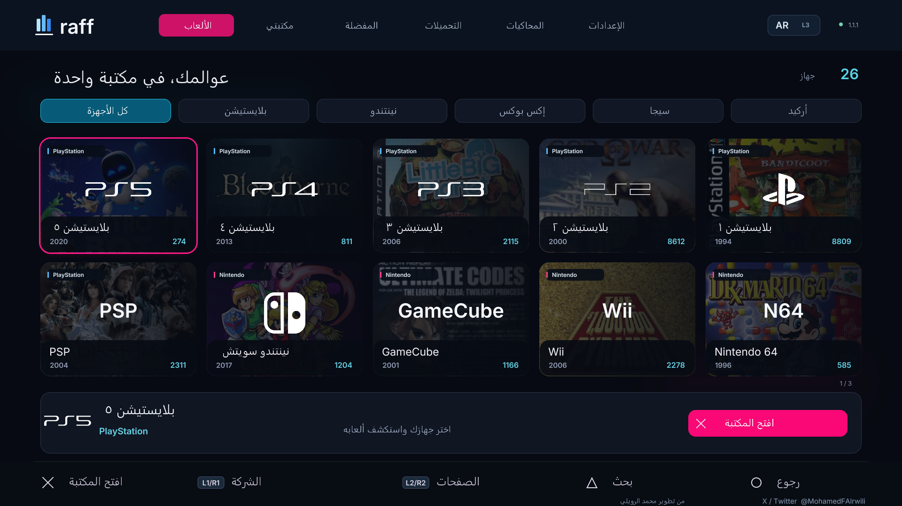

# رفّ · Raff

مكتبة ألعاب ومحاكيات بواجهة أصلية على PS5، بالعربية والإنجليزية. من تطوير **محمد الرويلي** — [X / Twitter: @MohamedFAlrwili](https://x.com/MohamedFAlrwili).

اكتشف ألعابك حسب المنصة، اختر مصدرًا ونسخة، وتابع التحميل والنقل من مكان واحد. تدعم الواجهة يد التحكم، البحث، المفضلة، مسارات الألعاب، التحميل المتعدد، واختيار ملفات لعبة واحدة من التورنت.

## التحميل

[**تحميل مثبّت رفّ ELF**](https://github.com/Alruwili0x/raff/releases/download/v1.1.1/Raff-v1.1.1-Installer.elf) · [كل ملفات الإصدار](https://github.com/Alruwili0x/raff/releases)

واجهة أجهزة مصوّرة، فلترة حسب الشركة، أغلفة ألعاب، وتنقل كامل بيد التحكم. اختر الجهاز ثم افتح مكتبته. تظهر المحاكيات وملفاتها المتاحة دون تبويب مصادر أو روابط تنزيل مطوّلة.

## المتطلبات

| المطلوب | التفاصيل |
|---|---|
| الجهاز | PS5 مع بيئة homebrew تعمل بالفعل؛ جهاز التطوير يستخدم النظام 13.60. وجود الإصدار نفسه وحده لا يكفي. |
| تشغيل التطبيق | محمّل تطبيقات أصلية يدعم مجلد `/data/homebrew/PPSA99178`، مثل إعداد ShadowMount المستخدم في الاختبار. |
| محمّل ELF | يستمع محليًا على المنفذ 9021 لتشغيل خدمة رفّ ومثبت التحديث. |
| خدمات التحميل | aria2 مع BitTorrent، وWeb File Manager، و7-Zip Helper. حزمة التثبيت تضم النسخ المحددة وإشعاراتها، ويجهزها رفّ عند التشغيل الأول إذا لم تكن موجودة. |
| الإنترنت | لتنزيل الملفات والأغلفة الجديدة والتحقق من تحديثات GitHub. يمكن تصفح الفهارس والأغلفة المخزنة دون اتصال. |
| المساحة | مساحة التطبيق والألعاب، ومساحة إضافية لفك الضغط. للتحديث: حجم الحزمة × 3 + 128 MiB حد أولي، مع مساحة إضافية لنسخ الأغلفة عند عدم دعم الروابط الصلبة. |
| المحاكيات | تُثبت مستقلة. رفّ لا يحوّل جهازًا غير مدعوم إلى جهاز متوافق ولا يضمن تشغيل كل لعبة. |

لا تحتاج إلى حساب GitHub لاستخدام التطبيق. لا يحتاج الاستخدام اليومي إلى تشغيل خادم على الكمبيوتر. لا تتضمن الحزمة ألعابًا أو BIOS أو مفاتيح أجهزة أو بيانات حسابات.

## التثبيت الأسهل — ELF مرة واحدة

1. حمّل **Raff-v1.1.1-Installer.elf** من الرابط أعلاه.
2. فعّل بيئة homebrew ومحمّل التطبيقات مثل ShadowMountPlus على السوني.
3. شغّل ملف المثبّت عبر محمّل ELF المعتاد لديك؛ مثل إرساله إلى منفذ 9021 أو تشغيله من مدير الملفات.
4. انتظر إشعار اكتمال التثبيت. ينزّل المثبّت ملفات رفّ من هذا المستودع ويتحقق من سلامتها ويضعها في المسار الصحيح.
5. افتح **Raff - Game Library** من **Games** بعد فحص التطبيقات. لا تحتاج تشغيل مثبّت ELF عند كل استخدام. إذا لم تظهر الأيقونة فأعد فحص محمّل التطبيقات بعد إغلاق أي لعبة مفتوحة.

المثبّت يحتاج اتصال إنترنت وحوالي 700 MiB مساحة فارغة مبدئيًا. تُحمّل الأغلفة عند الطلب. لا يثبت جلبريك أو محاكيات أو ألعابًا، ولا يغيّر إعدادات النظام. إذا كانت رفّ مثبتة بالفعل، يتركها كما هي ويوجّهك للتحديث من داخلها.

**التثبيت اليدوي:** ملف **Raff-v1.1.1-install.zip** بديل يتضمن ذاكرة الأغلفة. فكّه وانقل مجلد **PPSA99178** إلى **/data/homebrew/**، ثم أعد فحص التطبيقات. احتفظ بصلاحيات 0755 لملفات eboot.bin وELF وPRX، و0644 للبيانات.

**عند الترقية اليدوية:** أغلق رفّ وأوقف تحميلاته مؤقتًا. احتفظ بمجلد **/data/raff/native-v5** وملفات الألعاب؛ لا تنقل بيانات جهاز آخر إلى جهازك.

## التحديث من التطبيق

يبحث رفّ عن أحدث **GitHub Release مستقر** عند تشغيل خدمته ثم كل ست ساعات تقريبًا. يظهر التنبيه عندما تكون الخدمة متصلة؛ ليس إشعارًا سحابيًا يصل والجهاز مطفأ.

افتح **الإعدادات ← عن رفّ والتحديثات**، ثم «تحميل التحديث». يعرض التقدم ويتحقق من SHA-256 ومن كل ملف. بعد «تثبيت وإغلاق رفّ» يُنتظر إغلاق التطبيق، ثم تُستبدل ملفات البرنامج. أعد فتحه بعد اكتمال التثبيت. أوقف التحميلات أولًا؛ لا يُقطع نقل لعبة أو تثبيتها لإجراء تحديث.

تبقى الألعاب والإعدادات والتحميلات في أماكنها، وتُحتفظ الأغلفة والنسخة السابقة. لا يعدّل هذا النظام إعدادات تحديث نظام PS5. راجع [طريقة التحديث والاسترجاع](docs/UPDATES.md).

## مسارات شائعة

| المنصة | المحاكي / التشغيل | المسار الافتراضي |
|---|---|---|
| PS1 | PSXS5 عند اكتشافه، أو RetroArch | `/data/PSXS5/games` أو `/data/homebrew/PPSA99169/content/PS1` |
| PS2 | PS5SX2 | `/data/PCSX2/games` |
| PS3 | RPCS3، تجريبي | `/data/rpcs3/games` |
| Switch | ProsperoEden | `/data/prosperoeden/roms` |
| PS4 / PS5 | حسب دعم بيئة الجهاز والصيغة | `/data/etaHEN/games` |
| Xbox | XPSemu | `/data/xemu/games` |
| Xbox 360 | PS5X360، تجريبي | `/data/xbox360` |
| بقية المنصات | الكور المناسب داخل RetroArch | `/data/homebrew/PPSA99169/content/` مع مجلد لكل منصة |

ظهور منصة أو ملف في الفهرس يعني وجود بيانات له، وليس إثبات توافقه مع المحاكي. ملفات PS3 PKG مثلًا لا تُثبت كلعبة PS5، بل داخل محاكي PS3 عند دعمه.

## التحكم

| الزر | الوظيفة |
|---|---|
| × / ○ | اختيار / رجوع |
| L1 / R1 | تغيير الشركة في لوحة الأجهزة، أو المنصة داخل المكتبة |
| L2 / R2 | الصفحات؛ مجموعات الإعدادات داخل الإعدادات |
| △ / □ | البحث / الترتيب والفلترة |
| L3 | تغيير اللغة |
| R3 | شبكة الأغلفة / العرض السينمائي |
| Options | الإعدادات |

## English

Raff is a native PS5 game and emulator library by **Mohammed Al-Ruwaili** ([X / Twitter](https://x.com/MohamedFAlrwili)), with Arabic and English UI, controller navigation, direct downloads and per-game torrent selection. Daily use runs locally on the console. It requires an already working homebrew environment, a native app loader and a local ELF loader on port 9021. The development console runs firmware 13.60; support on other configurations has not been established.

Run **Raff-v1.1.1-Installer.elf** once through your existing ELF loader. It downloads the pinned release over verified HTTPS, checks every file, and installs Raff for your homebrew app loader. Open Raff from Games after the scan. Existing installations are left untouched. The install ZIP is an alternative that includes cached artwork. Configure your own emulator folders. Emulators, games, BIOS files and console keys are separate.

Stable GitHub releases are checked periodically while the service runs, without a GitHub login. Settings → About & updates lets you download, verify and install an update. Pause downloads first; installation closes Raff. Personal data stays in `/data/raff/native-v5`, and game folders are not replaced. Artwork is retained so updates do not download the full cover cache again.

See [build instructions](docs/BUILD.md), [updates and recovery](docs/UPDATES.md), [privacy](docs/PRIVACY.md) and [third-party notices](THIRD_PARTY_NOTICES.md). Raff code is GPL-3.0-or-later; linked metadata, artwork and dependencies retain their respective terms.
