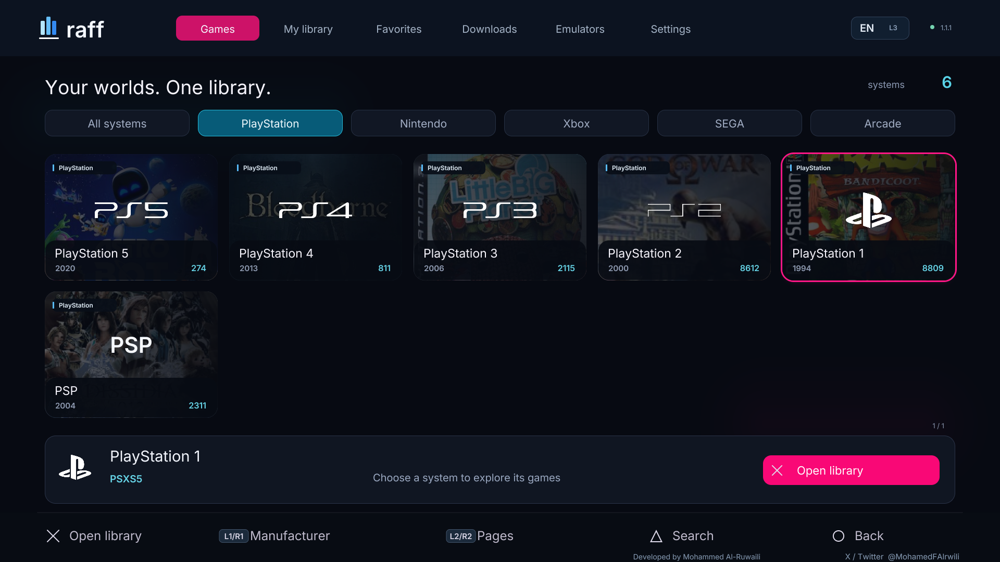
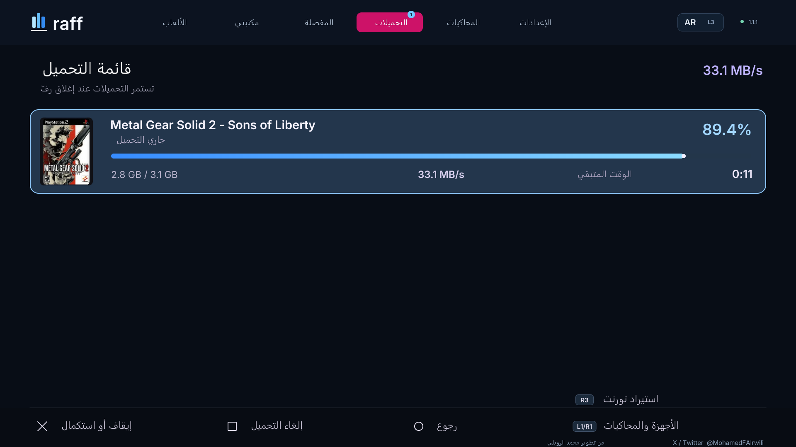

<a href="../README.md" lang="ar">العربية</a> · <strong>English</strong>

# Raff — Game and emulator library

A native PS5 interface with Arabic and English support and controller navigation. Browse systems, open your game library, and manage downloads in one place.

**Developed by Mohammed Al-Ruwaili**

[X / Twitter · @MohamedFAlrwili](https://x.com/MohamedFAlrwili)

**[Download the Raff installer](https://github.com/Alruwili0x/raff/releases/download/v1.1.1/Raff-v1.1.1-Installer.elf)** · [Release page](https://github.com/Alruwili0x/raff/releases/tag/v1.1.1) · [All releases](https://github.com/Alruwili0x/raff/releases)

## Start with this file

For a first installation, download **only the installer**:

`Raff-v1.1.1-Installer.elf`

Run it once with an internet connection. It downloads and verifies Raff, then places its files in the application folder. When you first open Raff, it prepares the download and extraction tools if they are missing.

**Already installed?** Update from inside Raff. The installer leaves existing installations untouched.

## Features

- Illustrated system cards, recognizable logos, and manufacturer filters.
- Arabic and English UI, controller navigation, search, and favorites.
- Direct and torrent downloads, with selection of the requested game's files within a torrent.
- Multiple downloads, progress bars, transfer speeds, and estimated time remaining.
- Configurable game folders and in-app updates.

Daily use runs locally on the console. A PC server or GitHub account is not required.

## Download speed

A real **Metal Gear Solid 2 — Sons of Liberty** download captured on the PS5 using Raff **1.1.1** on **9 October 2026**. The Arabic UI shows **33.1 MB/s**, **89.4%** progress, and **11 seconds** remaining:

This is an instantaneous reading at the time of capture. Speeds vary with your connection, download source, and concurrent transfers; it is neither a guaranteed rate nor a speed limit.

## Prerequisites

1. **A PS5 with a working jailbreak and homebrew environment.** The development console runs firmware **13.60**; the firmware number alone is not sufficient.
2. **A compatible native application loader,** such as ShadowMountPlus, supporting Raff's application folder below.
3. **An ELF loader** listening locally on port **9021**.
4. **Internet access and free space.** Allow approximately **700 MiB** for the initial installation, plus space for artwork, games, and extraction.

Application folder:

`/data/homebrew/PPSA99178`

## What does Raff prepare automatically?

The package includes ready-to-run versions of these tools. Raff prepares them on first launch if they are missing:

| Tool | Purpose |
|---|---|
| aria2 | Direct and BitTorrent downloads. |
| Web File Manager | File-management services used by Raff. |
| 7-Zip Helper | Extraction of supported archives. |

**Installed separately:** the jailbreak, application and ELF loaders, emulators, games, BIOS files, and console keys. The Raff installer does not install these or change system settings.

## Installation

1. Download the installer using the button above.
2. Activate your jailbreak, native application loader, and ELF loader on the PS5.
3. Run the installer through your usual loader, for example by sending it to port **9021** or launching it from a file manager.
4. Keep the PS5 on and wait for the completion notification.
5. After the application scan, open **Raff - Game Library** from **Games**.

If the icon does not appear, close any open game and rescan in your application loader. You do not need to run the installer for every use. Artwork downloads on demand; cached catalogs and artwork can be browsed offline.

## Which release asset should I download?

| File | Purpose |
|---|---|
| `Raff-v1.1.1-Installer.elf` | **The usual choice: the Raff installer.** |
| `Raff-v1.1.1-install.zip` | Manual installation alternative, including cached artwork. |
| `Raff-v1.1.1.raffupdate` | Package downloaded by Raff's in-app updater. |
| `Raff-v1.1.1-source.zip` / `Raff-v1.1.1-build-assets.zip` | Source code and build inputs for developers. |
| `*.tar.gz` / `Source code (zip)` | Source archives, not executables. Regular users do not need them. |
| `SHA256SUMS.txt` / `manifest.json` / `VALIDATION.md` | File hashes, package inventory, and test results. |

## Updating inside Raff

Open **Settings → About & updates → Download update**. Raff displays progress and verifies the package and its files.

Pause downloads and wait for installations or file operations to finish, then choose **Install & close Raff**. Wait for the completion notification before reopening the application. Games, settings, and transfer history remain; artwork and the previous application are retained for recovery.

The service checks for a stable GitHub release on startup when its saved schedule permits, then approximately every six hours. Notifications appear while the service is running and connected, not while the console is off. This updates **Raff** and does not change PS5 system-update settings.

The initial update-space check requires three times the package size plus **128 MiB**; copying artwork may need additional space. See [updates and recovery](UPDATES.md).

## Manual installation

Extract the install ZIP, place the application folder at the following destination, and rescan applications:

`PPSA99178 → /data/homebrew/PPSA99178`

Preserve mode **0755** for `eboot.bin`, ELF files, and PRX modules, and **0644** for data files.

For a manual upgrade, close Raff and pause its downloads. Keep game files and the user-data folder below. Do not replace it with data from another console.

`/data/raff/native-v5`

## Common game folders

Folders can be changed in Raff's settings. Detection of an installed emulator and its configuration can affect the selected destination.

| Platform | Emulator or launch method | Default folder |
|---|---|---|
| PS1 | PSXS5 / RetroArch | `/data/PSXS5/games` or `/data/homebrew/PPSA99169/content/PS1` |
| PS2 | PS5SX2 | `/data/PCSX2/games` |
| PS3 | RPCS3, experimental | `/data/rpcs3/games` |
| Nintendo Switch | ProsperoEden | `/data/prosperoeden/roms` |
| PS4 / PS5 | Depends on the console environment and file format | `/data/etaHEN/games` |
| Xbox | XPSemu | `/data/xemu/games` |
| Xbox 360 | PS5X360, experimental | `/data/xbox360` |
| Other systems | Appropriate RetroArch core | `/data/homebrew/PPSA99169/content/` |

Other systems use a separate subfolder per platform. A catalog entry does not guarantee emulator compatibility. For example, PS3 packages are installed within a supporting PS3 emulator, not as PS5 applications.

## Controls

| Button | Action |
|---|---|
| × / ○ | Select / back. |
| L1 / R1 | Change manufacturer on the dashboard, or platform inside the library. |
| L2 / R2 | Change page, or settings group within settings. |
| △ / □ | Search / sorting and filtering inside the library. |
| L3 | Change language. |
| R3 | Switch between cover grid and cinematic view inside the library. |
| Options | Open settings. |

## Compatibility and documentation

Raff was tested on the development console running **13.60** with the environment described above. Compatibility with every firmware, loader, or emulator has not been established. The package contains no games, BIOS files, console keys, or account data.

- [Test results and limitations](VALIDATION.md)
- [Build instructions](BUILD.md)
- [Updates and recovery](UPDATES.md)
- [Privacy](PRIVACY.md)
- [Third-party notices](../THIRD_PARTY_NOTICES.md)

Raff's code is licensed under **GPL-3.0-or-later**. Metadata, artwork, and external components retain their own licenses and owners' rights.

